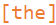
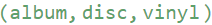
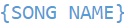
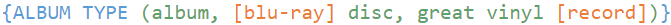
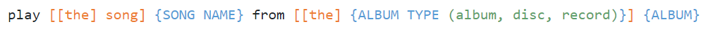
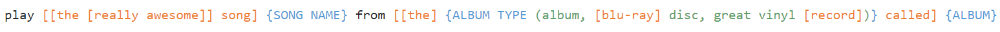

# Command Recognition Language (CRL)

Implementação da linguagem de reconhecimento de comandos, usada no SpeakMaster para a definição e estruturação de autômatos de comandos de voz.

Nessa linguagem, temos as seguintes funcionalidades:

- Colchetes são usados para denotar termos opcionais que podem ou não ser falados:

	

- Parênteses são usados para denotar uma lista de possíveis termos que podem ser falados:

	

- Chaves são usadas para denotar variáveis que reconhecem qualquer sequência de termos da entrada:

	

- Além disso, é possível restringir o reconhecimento de variáveis adicionando uma lista de opções de termos à sua definição:

	

Ao ser realizado o reconhecimento de uma dada entrada, os valores reconhecidos e associados as variáveis ficam disponíveis para acesso e utilização conforme demonstrado abaixo.

## Como Usar

Dado o comando abaixo:



O seguinte código é capaz de validar se uma dada entrada é ou não reconhecida por este comando:

```javascript
const { Automata } = require("speakmaster-crl");

// Para definir um comando:
// Passe a definição do comando usando a linguagem CRL como parâmetro na criação de uma instância da classe Automata
const command = new Automata("play [[the] song] {SONG NAME} from [[the] {ALBUM TYPE (album, disc, record)}] {ALBUM}");

// Para verificar se uma entrada é reconhecida por um comando:
console.log(command.match("play where do we go from brave enough"));
/*Match {
	match: true,
	variables: {
		'SONG NAME': 'where do we go',
		ALBUM: 'brave enough',
		'ALBUM TYPE': ''
	},
	isBest: true
}*/

console.log(command.match("play the song where do we go from the record brave enough"));
/*Match {
	match: true,
	variables: {
		'SONG NAME': 'where do we go',
		ALBUM: 'brave enough',
		'ALBUM TYPE': 'record'
	},
	isBest: true
}*/

console.log(command.match("play where do we go"));
/*Match { match: false, variables: {}, isBest: false }*/

// Para obter todas as possibilidades de comandos:
console.log(command.getAllPossibilities());
/*[
	'play {SONG NAME} from {ALBUM}',
	'play song {SONG NAME} from {ALBUM}',
	'play {SONG NAME} from album {ALBUM}',
	'play {SONG NAME} from disc {ALBUM}',
	'play {SONG NAME} from record {ALBUM}',
	'play the song {SONG NAME} from {ALBUM}',
	'play song {SONG NAME} from album {ALBUM}',
	'play song {SONG NAME} from disc {ALBUM}',
	'play song {SONG NAME} from record {ALBUM}',
	'play {SONG NAME} from the album {ALBUM}',
	'play {SONG NAME} from the disc {ALBUM}',
	'play {SONG NAME} from the record {ALBUM}',
	'play the song {SONG NAME} from album {ALBUM}',
	'play the song {SONG NAME} from disc {ALBUM}',
	'play the song {SONG NAME} from record {ALBUM}',
	'play song {SONG NAME} from the album {ALBUM}',
	'play song {SONG NAME} from the disc {ALBUM}',
	'play song {SONG NAME} from the record {ALBUM}',
	'play the song {SONG NAME} from the album {ALBUM}',
	'play the song {SONG NAME} from the disc {ALBUM}',
	'play the song {SONG NAME} from the record {ALBUM}'
]*/
```

### Para apenas validar a sintaxe de um comando:

```javascript
const { validateSyntax } = require("speakmaster-crl");

const error = validateSyntax("play [the] song] {SONG NAME}");

console.log(error.message, { line: error.line, column: error.column });
// Unexpected lexeme "]" at 16 { line: 1, column: 16 }
```

## Definição da gramática oficial no formato de Backus Naur Estendida (EBNF):

```EBNF
<sentence> ::= <sentence> <sentence>
               <term>
               '[' <optional> ']'
               '(' <list> ')'
               '{' <variable> '}'

<optional> ::= <optional> <optional>
               <term>
               '[' <optional> ']'
               '(' <list> ')'
               '{' <variable> '}'

<list>     ::= <item>
               <item> ',' <list>

<item>     ::= <item> <item>
               <term>
               '[' <optional> ']'
               '(' <list> ')'
               '{' <variable> '}'

<variable> ::= <string> { <string> } ['(' <list> ')']

<term>     ::= <string>
```

**Estado inicial:** `<sentence>`

**Observação:** uma `<string>` deve ser uma string contínua sem espaços.

### **Exemplo de Árvore de derivação**

#### **play [[the [really awesome]] song] {SONG NAME} from [[the] {ALBUM TYPE (album, [blu-ray] disc, great vinyl [record])} called] {ALBUM}**



```
<sentence>
<sentence> <sentence>
<term> <sentence>
<string> <sentence>
play <sentence>
play <sentence> <sentence>
play [<optional>] <sentence>
play [<optional> <optional>] <sentence>
play [[<optional>] <optional>] <sentence>
play [[<optional> <optional>] <optional>] <sentence>
play [[<term> <optional>] <optional>] <sentence>
play [[<string> <optional>] <optional>] <sentence>
play [[the <optional>] <optional>] <sentence>
play [[the [<optional>]] <optional>] <sentence>
play [[the [<optional> <optional>]] <optional>] <sentence>
play [[the [<term> <optional>]] <optional>] <sentence>
play [[the [<string> <optional>]] <optional>] <sentence>
play [[the [really <optional>]] <optional>] <sentence>
play [[the [really <term>]] <optional>] <sentence>
play [[the [really <string>]] <optional>] <sentence>
play [[the [really awesome]] <optional>] <sentence>
play [[the [really awesome]] <term>] <sentence>
play [[the [really awesome]] <string>] <sentence>
play [[the [really awesome]] song] <sentence>
play [[the [really awesome]] song] <sentence> <sentence>
play [[the [really awesome]] song] {<variable>} <sentence>
play [[the [really awesome]] song] {<string> <string>} <sentence>
play [[the [really awesome]] song] {SONG <string>} <sentence>
play [[the [really awesome]] song] {SONG NAME} <sentence>
play [[the [really awesome]] song] {SONG NAME} <sentence> <sentence>
play [[the [really awesome]] song] {SONG NAME} <term> <sentence>
play [[the [really awesome]] song] {SONG NAME} <string> <sentence>
play [[the [really awesome]] song] {SONG NAME} from <sentence>
play [[the [really awesome]] song] {SONG NAME} from <sentence> <sentence>
play [[the [really awesome]] song] {SONG NAME} from [<optional>] <sentence>
play [[the [really awesome]] song] {SONG NAME} from [<optional> <optional>] <sentence>
play [[the [really awesome]] song] {SONG NAME} from [[<optional>] <optional>] <sentence>
play [[the [really awesome]] song] {SONG NAME} from [[<term>] <optional>] <sentence>
play [[the [really awesome]] song] {SONG NAME} from [[<string>] <optional>] <sentence>
play [[the [really awesome]] song] {SONG NAME} from [[the] <optional>] <sentence>
play [[the [really awesome]] song] {SONG NAME} from [[the] <optional> <optional>] <sentence>
play [[the [really awesome]] song] {SONG NAME} from [[the] {<variable>} <optional>] <sentence>
play [[the [really awesome]] song] {SONG NAME} from [[the] {<string> <string> (<list>)} <optional>] <sentence>
play [[the [really awesome]] song] {SONG NAME} from [[the] {ALBUM <string> (<list>)} <optional>] <sentence>
play [[the [really awesome]] song] {SONG NAME} from [[the] {ALBUM TYPE (<list>)} <optional>] <sentence>
play [[the [really awesome]] song] {SONG NAME} from [[the] {ALBUM TYPE (<item>, <list>)} <optional>] <sentence>
play [[the [really awesome]] song] {SONG NAME} from [[the] {ALBUM TYPE (<term>, <list>)} <optional>] <sentence>
play [[the [really awesome]] song] {SONG NAME} from [[the] {ALBUM TYPE (<string>, <list>)} <optional>] <sentence>
play [[the [really awesome]] song] {SONG NAME} from [[the] {ALBUM TYPE (album, <list>)} <optional>] <sentence>
play [[the [really awesome]] song] {SONG NAME} from [[the] {ALBUM TYPE (album, <item>, <list>)} <optional>] <sentence>
play [[the [really awesome]] song] {SONG NAME} from [[the] {ALBUM TYPE (album, <item> <item>, <list>)} <optional>] <sentence>
play [[the [really awesome]] song] {SONG NAME} from [[the] {ALBUM TYPE (album, [<optional>] <item>, <list>)} <optional>] <sentence>
play [[the [really awesome]] song] {SONG NAME} from [[the] {ALBUM TYPE (album, [<term>] <item>, <list>)} <optional>] <sentence>
play [[the [really awesome]] song] {SONG NAME} from [[the] {ALBUM TYPE (album, [<string>] <item>, <list>)} <optional>] <sentence>
play [[the [really awesome]] song] {SONG NAME} from [[the] {ALBUM TYPE (album, [blu-ray] <item>, <list>)} <optional>] <sentence>
play [[the [really awesome]] song] {SONG NAME} from [[the] {ALBUM TYPE (album, [blu-ray] <term>, <list>)} <optional>] <sentence>
play [[the [really awesome]] song] {SONG NAME} from [[the] {ALBUM TYPE (album, [blu-ray] <string>, <list>)} <optional>] <sentence>
play [[the [really awesome]] song] {SONG NAME} from [[the] {ALBUM TYPE (album, [blu-ray] disc, <list>)} <optional>] <sentence>
play [[the [really awesome]] song] {SONG NAME} from [[the] {ALBUM TYPE (album, [blu-ray] disc, <item>)} <optional>] <sentence>
play [[the [really awesome]] song] {SONG NAME} from [[the] {ALBUM TYPE (album, [blu-ray] disc, <item> <item>)} <optional>] <sentence>
play [[the [really awesome]] song] {SONG NAME} from [[the] {ALBUM TYPE (album, [blu-ray] disc, <term> <item>)} <optional>] <sentence>
play [[the [really awesome]] song] {SONG NAME} from [[the] {ALBUM TYPE (album, [blu-ray] disc, <string> <item>)} <optional>] <sentence>
play [[the [really awesome]] song] {SONG NAME} from [[the] {ALBUM TYPE (album, [blu-ray] disc, great <item>)} <optional>] <sentence>
play [[the [really awesome]] song] {SONG NAME} from [[the] {ALBUM TYPE (album, [blu-ray] disc, great <item> <item>)} <optional>] <sentence>
play [[the [really awesome]] song] {SONG NAME} from [[the] {ALBUM TYPE (album, [blu-ray] disc, great <term> <item>)} <optional>] <sentence>
play [[the [really awesome]] song] {SONG NAME} from [[the] {ALBUM TYPE (album, [blu-ray] disc, great <string> <item>)} <optional>] <sentence>
play [[the [really awesome]] song] {SONG NAME} from [[the] {ALBUM TYPE (album, [blu-ray] disc, great vinyl <item>)} <optional>] <sentence>
play [[the [really awesome]] song] {SONG NAME} from [[the] {ALBUM TYPE (album, [blu-ray] disc, great vinyl [<optional>])} <optional>] <sentence>
play [[the [really awesome]] song] {SONG NAME} from [[the] {ALBUM TYPE (album, [blu-ray] disc, great vinyl [<term>])} <optional>] <sentence>
play [[the [really awesome]] song] {SONG NAME} from [[the] {ALBUM TYPE (album, [blu-ray] disc, great vinyl [<string>])} <optional>] <sentence>
play [[the [really awesome]] song] {SONG NAME} from [[the] {ALBUM TYPE (album, [blu-ray] disc, great vinyl [record])} <optional>] <sentence>
play [[the [really awesome]] song] {SONG NAME} from [[the] {ALBUM TYPE (album, [blu-ray] disc, great vinyl [record])} <term>] <sentence>
play [[the [really awesome]] song] {SONG NAME} from [[the] {ALBUM TYPE (album, [blu-ray] disc, great vinyl [record])} <string>] <sentence>
play [[the [really awesome]] song] {SONG NAME} from [[the] {ALBUM TYPE (album, [blu-ray] disc, great vinyl [record])} called] <sentence>
play [[the [really awesome]] song] {SONG NAME} from [[the] {ALBUM TYPE (album, [blu-ray] disc, great vinyl [record])} called] {<variable>}
play [[the [really awesome]] song] {SONG NAME} from [[the] {ALBUM TYPE (album, [blu-ray] disc, great vinyl [record])} called] {<string>}
play [[the [really awesome]] song] {SONG NAME} from [[the] {ALBUM TYPE (album, [blu-ray] disc, great vinyl [record])} called] {ALBUM}
```
